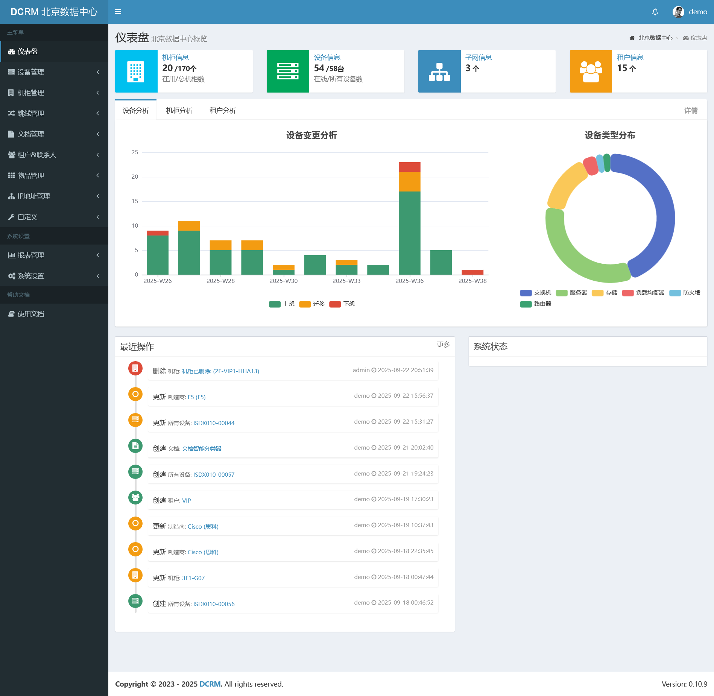
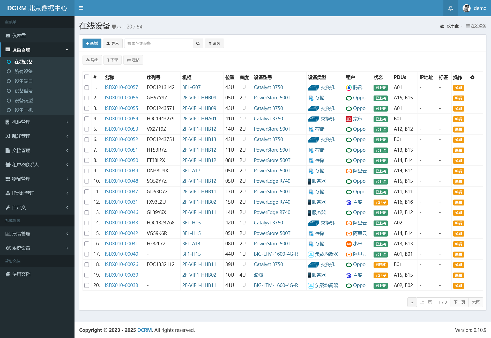
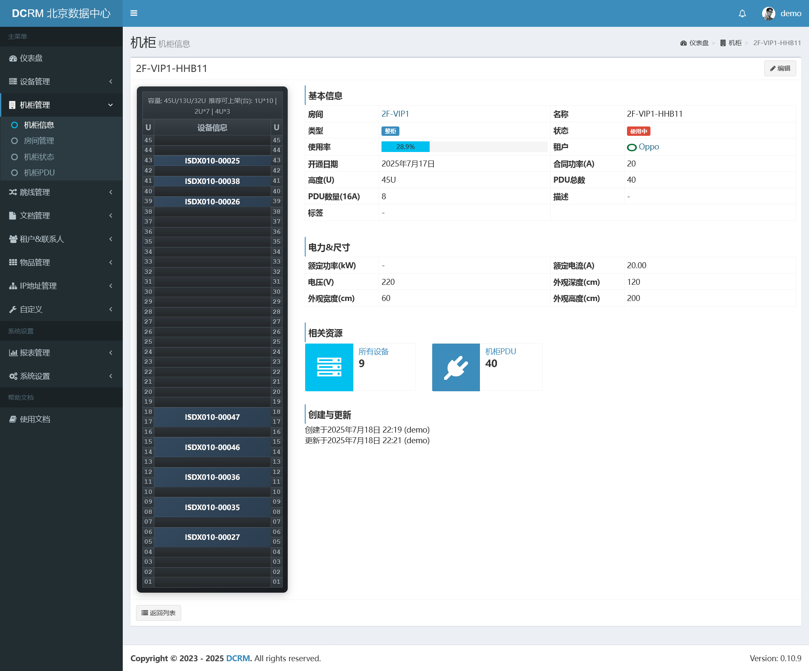
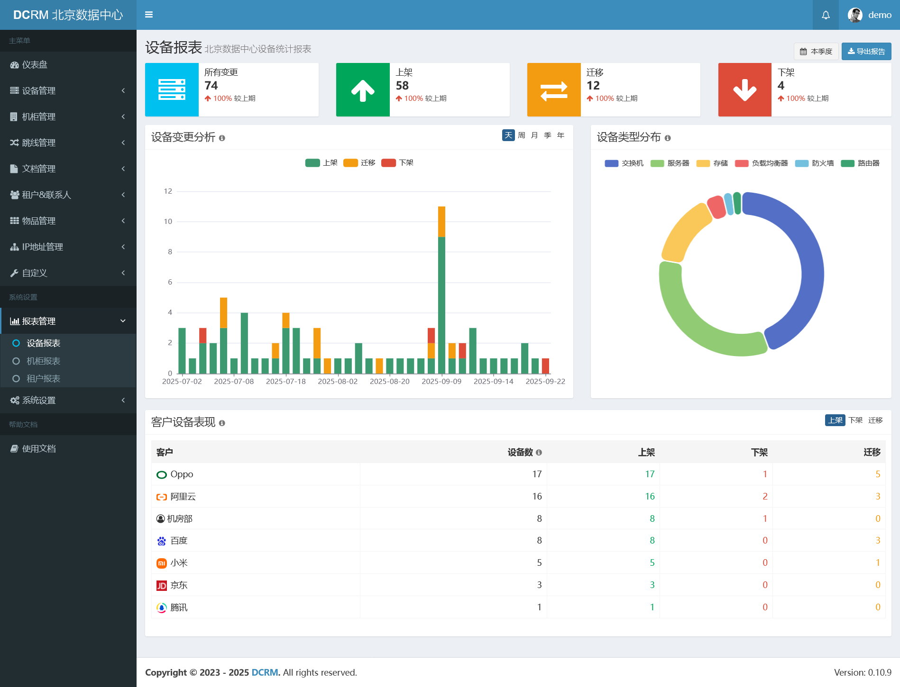
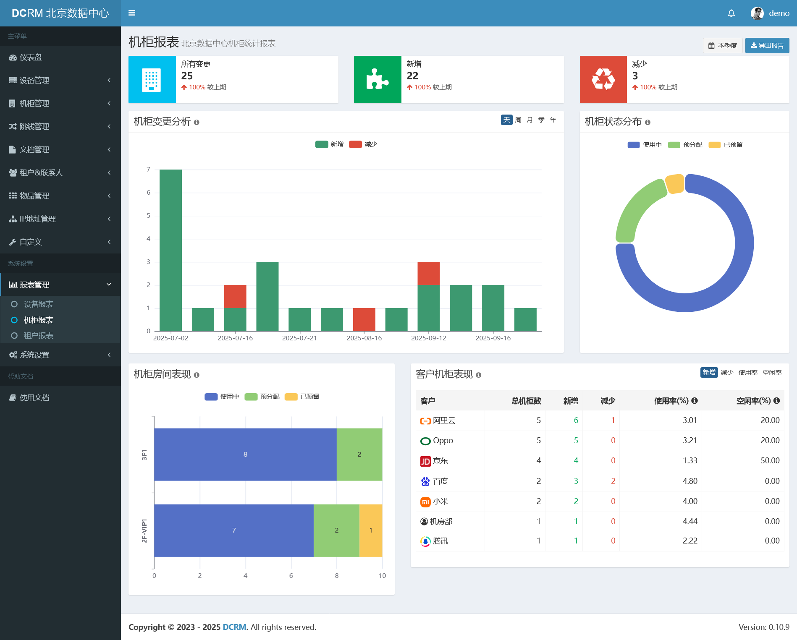
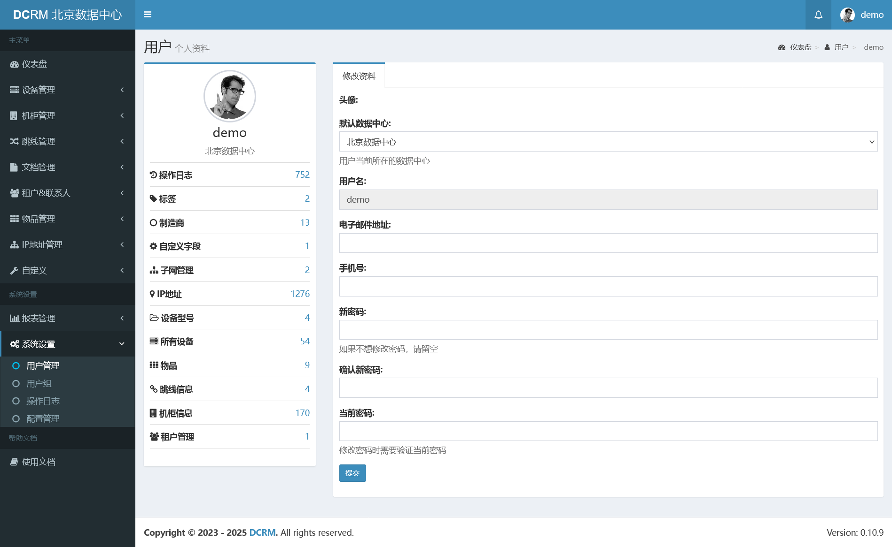
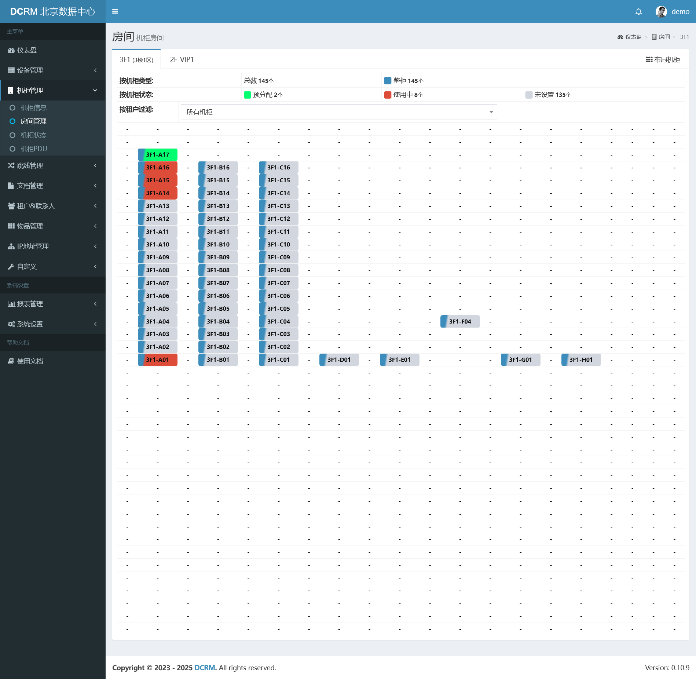
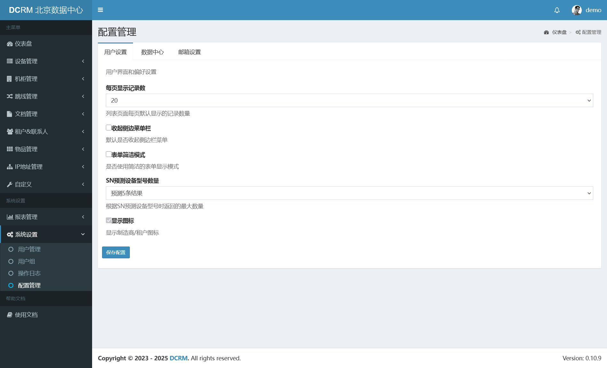

# 数据中心资源管理 (DCRM)

Data Center Resources Manager(DCRM) 数据中心资源管理是一个基于 Django 开发的专业数据中心运营管理系统，专注于为数据中心运营商提供完整的资源管理解决方案。系统包含数据中心、客户、机柜、设备、跳线、库存物品、测试、文档等多个核心模块，实现各类资源的集中管理与数据可视化。
idcops 遵循 Apache License 2.0。

Gitee: [https://gitee.com/decbe/idcops](https://gitee.com/decbe/idcops)

## 交流讨论

QQ群：185964462

---

## 在线演示地址

[开源版地址](https://idcops.yuzekeji.cn/)

账户： admin

密码： admin.123

[DCRM 演示地址](https://ndcrm.yuzekeji.cn/)

DCRM账户： demo

密码：admin.123

---

有任何疑问可以关注公众号 **IDC 运维管理平台** ，加我好友或直接私信我。

## 演示截图

### 仪表盘



<details>
<summary>点击展开查看更多系统截图</summary>

### 设备管理



### 机柜视图



### 设备报表



### 机柜报表



### 个人资料



### 机房视图



### 配置管理


</details>

---

## 目录

- [核心特性](#核心特性)
- [功能模块](#功能模块)
  - [网络资源管理](#网络资源管理)
  - [设备资源管理](#设备资源管理)
- [系统要求](#系统要求)
- [快速开始](#快速开始)
- [配置说明](#配置说明)
- [常见问题](#常见问题)

## 核心特性

- **多数据中心**: 支持多数据中心独立管理，资源相互隔离(开源版不支持)
- **资产管理**: 全面的数据中心资产跟踪，包括设备、机柜、线缆等
- **客户管理**: 完整的客户信息及资源管理
- **自定义字段**: 支持为主要模型添加自定义字段
- **权限控制**: 细粒度的角色权限管理
- **库存管理**: 小型完整的库存管理系统
- **操作审计**: 完整的资源变更记录
- **网络管理**: 全面的网络资源管理，包括IP地址、子网、VLAN等
- **设备管理**: 设备全生命周期管理，支持多种设备类型和型号
- **API接口**: 完整的RESTful API接口，支持系统集成
- **机器学习**: 内置设备型号预测等智能功能(开源版不支持)
- **OCR支持**: 集成百度OCR，支持自动识别填充(开源版不支持)

## 功能模块

### 网络资源管理

- **IP地址管理**
  - 支持 IPv4/IPv6 地址管理
  - IP地址生命周期跟踪
  - MAC地址绑定
  - 自动地址分配
  - 地址使用率统计

- **子网管理**
  - 树形网络层级管理
  - 子网划分与分配
  - DNS服务器配置
  - 网关管理
  - 使用率监控

- **VLAN管理**
  - VLAN资源池
  - 租户VLAN分配
  - VLAN使用状态跟踪
  - 关联子网配置

- **网络服务**
  - 代理服务器管理
  - 网络性能监控
  - 自动化网络配置
  - 网络拓扑可视化

### 设备资源管理

- **设备类型管理**
  - 设备类型分类
  - 设备型号配置
  - 端口模板定义
  - 设备规格管理

- **设备实例管理**
  - 设备生命周期跟踪
  - 设备状态监控
  - 设备端口管理
  - 设备主机信息
  - 资产编号管理

- **智能功能**
  - 设备型号自动识别
  - 配置智能推荐
  - 异常检测预警
  - 使用率预测

- **资源关联**
  - 设备与机柜关联
  - 网络端口映射
  - 跳线关系管理
  - 业务系统关联

## 系统要求

- Python 3.10+
- Django 5.2
- PostgreSQL 14+

## 快速开始

### Docker 部署

```bash
git clone https://gitee.com/decbe/idcops.git
cd idcops
cp .env.docker .env
docker-compose -f docker-compose.yml up -d
```

### 手动部署

```bash
# 安装系统依赖(Debian/Ubuntu)
sudo apt-get update && sudo apt-get install -y --no-install-recommends \
  tzdata \
  curl \
  git \
  ca-certificates \
  build-essential \
  libffi-dev \
  file \
  python3-dev \
  libjpeg-dev \
  zlib1g-dev \
  libfreetype6-dev \
  liblcms2-dev \
  libopenjp2-7-dev \
  libtiff5-dev \
  tk-dev \
  tcl-dev \
  libharfbuzz-dev \
  libfribidi-dev \
  libjpeg62-turbo-dev \
  g++ \
  netcat-openbsd \
  libpq-dev \
  pkg-config \
  gcc

# ！！！另外需要自行安装 postgresql 和 redis 服务
```

```bash
# 安装uv管理器
pip install -U pip
pip install uv -i https://mirrors.aliyun.com/pypi/simple/
# 下载项目
git clone https://gitee.com/decbe/idcops.git
# 创建虚拟环境
cd idcops # 项目根目录
cp .env.example .env # 复制并修改配置文件（需要安装postgresql和redis）
uv venv
source .venv/bin/activate  # Linux/Mac
# 安装依赖
uv sync
# 初始化数据库
python manage.py migrate
# 启动开发服务器
python manage.py runserver
```

### postgres 数据库管理

```bash
sudo -u postgres psql

# 查看数据库
\l

# 新建数据库与角色授权

# ALTER USER matchuser WITH PASSWORD '新密码';
# CREATE USER matchuser WITH PASSWORD '新密码';

CREATE DATABASE dcrm;
CREATE USER dcrmuser WITH PASSWORD '123456';
ALTER DATABASE dcrm OWNER TO dcrmuser;
GRANT ALL PRIVILEGES ON DATABASE dcrm TO dcrmuser;
GRANT ALL PRIVILEGES ON ALL TABLES IN SCHEMA public TO dcrmuser;
GRANT ALL PRIVILEGES ON ALL SEQUENCES IN SCHEMA public TO dcrmuser;

psql -U dcrmuser -d dcrm -h localhost

# 备份
sudo -u postgres pg_dump -d dcrm -Fc -f /tmp/backup.dump

# 恢复
sudo -u postgres pg_restore -d dcrm -Fc /tmp/backup.dump
```

### 服务管理

```bash
cd idcops/

cp contrib/idcops.service /etc/systemd/system/idcops.service
cp contrib/idcops-rq@.service /etc/systemd/system/idcops-rq@.service

systemctl daemon-reload
systemctl enable idcops.service
systemctl enable idcops-rq@01.service

# 启动
systemctl start idcops.service
systemctl start idcops-rq@01.service

# 停止
systemctl stop idcops.service
systemctl stop idcops-rq@01.service

# 重启
systemctl restart idcops.service
systemctl restart idcops-rq@01.service

# 状态
systemctl status idcops.service
systemctl status idcops-rq@01.service

```

## 配置说明

主要配置项（`.env`）：

```ini
# 调试模式（生产环境设为 false）
DEBUG=False

# 数据库配置
POSTGRES_DB=dcrm
POSTGRES_USER=dcrm
POSTGRES_PASSWORD=your_password
POSTGRES_HOST=postgres
POSTGRES_PORT=5432

# Redis 缓存
REDIS_HOST=redis
REDIS_PORT=6379
REDIS_DB=0
# REDIS_PASSWORD=

# 安全设置
SECRET_KEY=your-secret-key
ALLOWED_HOSTS=localhost,127.0.0.1
```

## 常见问题

### Q: 如何自定义设备类型？

A: 在管理界面中，导航至"设备管理" > "设备类型"，点击"添加"按钮创建新的设备类型。您可以定义设备类型的名称、描述、图标以及默认端口配置。

### Q: 如何批量导入设备？

A: 系统支持通过 CSV 表格批量导入设备。在"设备管理"页面，点击"批量导入"按钮，下载模板文件，填写后上传即可。

### Q: 系统支持哪些权限级别？

A: 系统支持多级权限控制，包括超级管理员、数据中心管理员、租户管理员和普通用户等角色，可在"系统设置" > "用户与权限"中配置。

---
